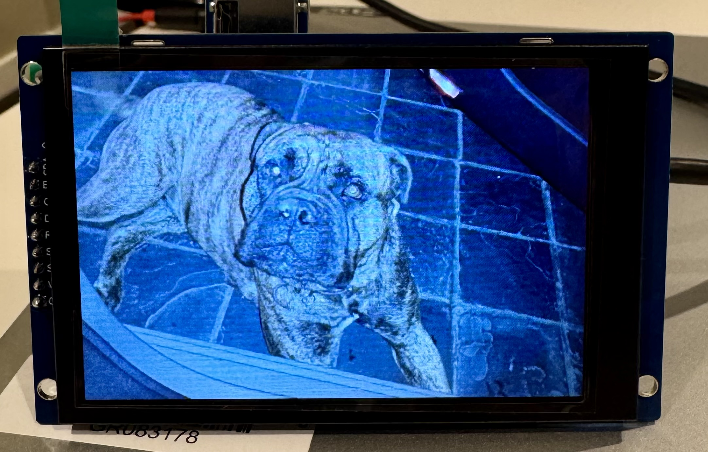
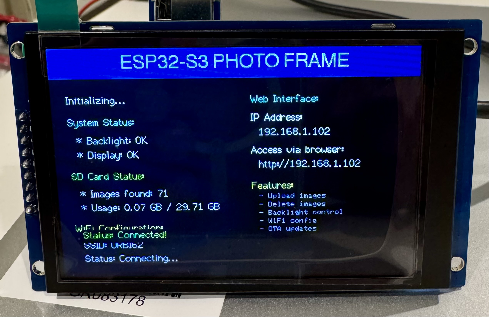
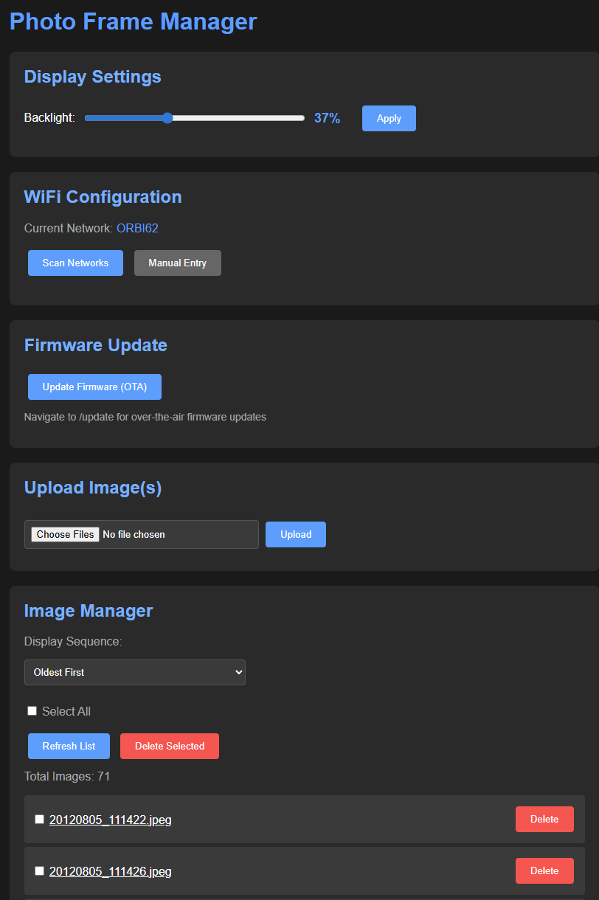

# ESP32-S3 Digital Photo Frame

A feature-rich digital photo frame built with ESP32-S3, featuring smooth transition effects, web-based image management, and OTA firmware updates.

  



## 📋 Table of Contents

- [Overview](#overview)
- [Hardware Requirements](#hardware-requirements)
- [Pin Configuration](#pin-configuration)
- [Hardware Connections](#hardware-connections)
- [Key Features](#key-features)
- [Software Requirements](#software-requirements)
- [Image Preparation](#image-preparation)
- [Web Interface](#web-interface)
- [OTA Firmware Updates](#ota-firmware-updates)
- [Configuration](#configuration)
- [Credits & Libraries](#credits--libraries)
- [Troubleshooting](#troubleshooting)

## 🎯 Overview

This project transforms an ESP32-S3 into a sophisticated digital photo frame with professional features typically found in commercial products. It displays JPEG images from an SD card with beautiful transition effects and provides a complete web interface for remote management.

### What Makes This Special?

- **Professional startup screen** with system diagnostics
- **Sprite buffering** for smooth image rendering from memory
- **Full web interface** for managing images without removing the SD card
- **OTA updates** - update firmware wirelessly
- **PSRAM optimization** for smooth performance with large images
- **Automatic image centering** for different aspect ratios

## 🔧 Hardware Requirements

| Component | Specification | Source |
|-----------|--------------|--------|
| **Microcontroller** | ESP32-S3 N16R8 (16MB Flash, 8MB PSRAM) | AliExpress/Amazon |
| **Display** | 3.5" ST7796 TFT LCD (480x320 pixels) | AliExpress |
| **SD Card Module** | 3.3V SD Card Reader (SPI interface) | AliExpress |
| **SD Card** | MicroSD card (8GB+ recommended, FAT32) | Any retailer |
| **Power Supply** | 5V 2A USB power adapter | Any retailer |

### Why These Components?

- **ESP32-S3 N16R8**: The 8MB PSRAM is essential for buffering images and creating smooth transitions
- **ST7796 Display**: Large enough to enjoy photos, bright, and affordable
- **3.3V SD Module**: Direct compatibility with ESP32 logic levels (no level shifters needed)

## 📌 Pin Configuration

### TFT Display Connections (SPI)

The TFT display uses the default ESP32-S3 VSPI bus:

| TFT Pin | ESP32-S3 Pin | Function |
|---------|--------------|----------|
| VCC | 3.3V | Power |
| GND | GND | Ground |
| CS | GPIO 5 | Chip Select |
| RESET | GPIO 6 | Reset |
| DC | GPIO 4 | Data/Command |
| MOSI | GPIO 11 | Data Out |
| SCK | GPIO 12 | Clock |
| LED | GPIO 7 | Backlight (PWM) |
| MISO | GPIO 13 | Data In |

### SD Card Reader Connections (HSPI)

The SD card module uses a separate SPI bus (HSPI) to avoid conflicts:

| SD Pin | ESP32-S3 Pin | Function |
|--------|--------------|----------|
| VCC | 3.3V | Power |
| GND | GND | Ground |
| CS | GPIO 15 | Chip Select |
| MOSI | GPIO 10 | Data Out |
| MISO | GPIO 14 | Data In |
| SCK | GPIO 21 | Clock |

### Wiring Schematic

```
ESP32-S3 N16R8
┌─────────────────────────────────────┐
│                                     │
│  [USB-C]                            │
│                                     │
│  3.3V ──────────┬──────────┬────────┤
│                 │          │        │
│  GND ───────────┼──────────┼────────┤
│                 │          │        │
│  GPIO 4  (DC)───┤          │        │
│  GPIO 5  (CS)───┤ ST7796   │        │
│  GPIO 6  (RST)──┤ Display  │        │
│  GPIO 7  (LED)──┤ 3.5"     │        │
│  GPIO 11 (MOSI)─┤          │        │
│  GPIO 12 (SCK)──┤          │        │
│  GPIO 13 (MISO)─┤          │        │
│                 │          │        │
│  GPIO 10 (MOSI)─┼──────────┤        │
│  GPIO 14 (MISO)─┼──────────┤ SD     │
│  GPIO 15 (CS)───┼──────────┤ Card   │
│  GPIO 21 (SCK)──┼──────────┤ Reader │
│                 │          │        │
└─────────────────┴──────────┴────────┘
```

### Important Notes

- All connections are 3.3V
- Ensure your SD card module is labeled as **3.3V compatible**
- Use short wires (< 10cm) for SPI connections to avoid signal issues
- The backlight pin (GPIO 7) uses PWM for brightness control

## ✨ Key Features

### 1. Smooth Transition Effects with Sprite Rendering

Four professional transition effects cycle automatically through each image:

- **Fade**: Gradual fade-in effect with 8-step brightness progression
- **Wipe Down**: Progressive vertical reveal from top to bottom
- **Pixelate**: Mosaic effect (32→16→8→4→2→1 pixel blocks) that gradually sharpens
- **None**: Instant display change

#### Technical Implementation:
- **Full-screen sprite buffer** - Creates a dedicated 480x320 pixel sprite in PSRAM
- **Zero flicker** - All rendering done off-screen then pushed in single operation
- **Hardware acceleration** - Uses TFT_eSprite for optimized DMA transfers
- **Dynamic memory management** - Sprite buffer automatically allocated at startup
- **Graceful degradation** - Falls back to direct rendering if sprite creation fails

### 2. Professional Startup Screen:



Displays comprehensive system diagnostics for 10 seconds on boot:

- **Visual design** - Navy title bar with white text on black background
- **System status section**:
  - Backlight initialization confirmation
  - Display initialization status
- **SD card section** (with color-coded status):
  - Total images found
  - Storage usage in GB (used/total)
  - Card capacity information
- **WiFi section**:
  - Network SSID display
  - Connection status (with real-time updates)
  - IP address assignment
  - Web interface URL
- **OTA section**:
  - Instructions for accessing web console
  - Firmware update endpoint information

All status information uses color coding: Cyan for headers, Green for success, Red for errors, Orange for warnings.

### 3. Web-Based Image Management

A complete web interface accessible from any browser on your network:

#### Features:
- **Upload multiple images** - Drag and drop or select multiple files
- **Visual file browser** - See all images on the SD card
- **Clickable thumbnails** - Click any image to view full-size in a new tab
- **Checkbox selection** - Select multiple images for batch operations
- **Delete selected** - Remove specific images with one click
- **Delete all** - Clear the entire SD card
- **Upload progress** - Real-time counter showing upload status
- **Responsive design** - Works on phones, tablets, and computers

#### How to Access:
1. Connect to the same WiFi network as your photo frame
2. Note the IP address shown on the startup screen
3. Open a web browser and navigate to `http://[IP_ADDRESS]`
4. Example: `http://192.168.1.100`

### 4. OTA Firmware Updates via ElegantOTA

Update firmware wirelessly without USB connection:

- **Elegant web interface** - Professional update page at `/update` endpoint
- **Secure uploads** - Integrity checking and validation
- **Safe rollback** - Automatic recovery if update fails
- **No downtime** - Quick updates without disassembly
- **Progress indication** - Real-time upload and installation feedback
- **Integrated with web console** - One-click access from main page

### 5. Smart Image Handling

- **Automatic centering** - Images smaller than screen are centered with black borders
- **Full image buffering** - Entire JPEG decoded to PSRAM before display (prevents partial rendering)
- **Dynamic buffer allocation** - Memory automatically resized based on image dimensions
- **Color correction** - Automatic byte-swapping for correct colors on ST7796 display
- **Progressive decoding** - Yields to system every 8 MCU rows to prevent watchdog crashes
- **MCU-based rendering** - Efficient JPEG decompression using Minimum Coded Units
- **Memory-efficient** - Reuses buffers when image dimensions match previous image

### 6. Dual SPI Bus Architecture

- **VSPI for display** - Dedicated SPI bus for TFT (GPIO 11, 12, 13)
- **HSPI for SD card** - Separate SPI bus prevents bus contention (GPIO 10, 14, 21)
- **No conflicts** - Display and SD card can operate simultaneously without interference
- **Optimized speeds** - 40MHz for display, 25MHz for SD card

### 7. Advanced Error Handling

- **SD card detection** - Graceful failure with error screen if card not detected
- **Image validation** - Skips hidden files (starting with `.` or `_`)
- **File type filtering** - Only scans `.jpg` and `.jpeg` extensions
- **Empty card handling** - Displays warning if no images found
- **WiFi fallback** - Continues operation in offline mode if WiFi fails
- **Serial debugging** - Comprehensive logging of all operations and errors

## 📦 Software Requirements

### Arduino IDE Setup

1. Install [Arduino IDE](https://www.arduino.cc/en/software) (version 2.0+ recommended)

2. Add ESP32 board support:
   - Go to **File > Preferences**
   - Add to "Additional Board Manager URLs":
     ```
     https://espressif.github.io/arduino-esp32/package_esp32_index.json
     ```
   - Go to **Tools > Board > Board Manager**
   - Search for "ESP32" and install "esp32 by Espressif Systems" (version 2.0.11+)

3. Select your board:
   - **Tools > Board > ESP32 Arduino > ESP32S3 Dev Module**

4. Configure board settings:
   - **USB CDC On Boot: Enabled**
   - **PSRAM: OPI PSRAM**
   - **Flash Size: 16MB**
   - **Partition Scheme: Default 4MB with spiffs**
   - **Upload Speed: 921600**

### Required Libraries

Install these libraries via **Tools > Manage Libraries** or Library Manager:

| Library | Version | Purpose | Modified? |
|---------|---------|---------|-----------|
| **TFT_eSPI** by Bodmer | 2.5.0+ | Display driver | ✅ Yes - See setup |
| **JPEGDecoder** by Bodmer | 1.8.0+ | JPEG image decoding | No |
| **ESPAsyncWebServer** | Latest | Web server framework | No |
| **AsyncTCP** | Latest | Async networking | No |
| **ElegantOTA** | 3.1.0+ | OTA update interface | ⚠️ Minor config |
| **ArduinoJson** | 6.21.0+ | JSON parsing | No |

### TFT_eSPI Configuration

The TFT_eSPI library requires configuration for your specific display. You must edit the `User_Setup.h` file:

1. Find the library location:
   - **Windows**: `Documents\Arduino\libraries\TFT_eSPI\`
   - **Mac**: `~/Documents/Arduino/libraries/TFT_eSPI/`
   - **Linux**: `~/Arduino/libraries/TFT_eSPI/`

2. Open `User_Setup.h` and configure:

```cpp
// Define ST7796 driver
#define ST7796_DRIVER

// Define display size
#define TFT_WIDTH  480
#define TFT_HEIGHT 320

// Define pins for ESP32-S3
#define TFT_MISO 13
#define TFT_MOSI 11
#define TFT_SCLK 12
#define TFT_CS   5
#define TFT_DC   4
#define TFT_RST  6
#define TFT_BL   7  
#define TFT_BACKLIGHT_ON HIGH // Level to turn ON back-light (HIGH or LOW)

// Enable SPI frequency
#define SPI_FREQUENCY  40000000
#define SPI_READ_FREQUENCY  20000000

// The ESP32 has 2 free SPI ports i.e. VSPI and HSPI, the VSPI is the default.
// If the VSPI port is in use and pins are not accessible (e.g. TTGO T-Beam)
// then uncomment the following line:
#define USE_FSPI_PORT // or USE_HSPI_PORT  //(Important!!!)
```

## 🖼️ Image Preparation

### Recommended Image Specifications

For best results, prepare your images with these guidelines:

| Property | Recommendation | Notes |
|----------|----------------|-------|
| **Format** | JPEG (.jpg or .jpeg) | Only JPEG is supported |
| **Resolution** | 480x320 pixels | Exact match for display |
| **Aspect Ratio** | 3:2 (same as display) | Prevents black bars |
| **File Size** | 50-200 KB | Balance quality and loading speed |
| **Color Space** | sRGB | Standard web color space |
| **Quality** | 85-95% | Good balance of quality/size |

### Sizing Guide

The display is **480x320 pixels** in landscape orientation. You have three options:

#### Option 1: Exact Size (Best)
- Resize images to exactly **480x320 pixels**
- No borders, fills entire screen
- Use tools like Photoshop, GIMP, or online resizers

#### Option 2: Maintain Aspect Ratio (Good)
- Resize to fit within 480x320 while maintaining proportions
- Example: 480x270 (16:9 photo) will have black bars top/bottom
- The frame automatically centers these images

#### Option 3: Original Size (Acceptable)
- Images larger than 480x320 will be displayed from top-left
- Images smaller than 480x320 will be centered with black borders
- May result in cropping or borders

### Batch Conversion Tools

**Windows:**
- [IrfanView](https://www.irfanview.com/) - Excellent batch conversion
- Batch conversion: File > Batch Conversion/Rename

**Mac:**
- Preview (built-in) - Can resize images
- [ImageOptim](https://imageoptim.com/) - Optimize file sizes

**Online:**
- [BulkResizePhotos.com](https://bulkresizephotos.com/)
- [iLoveIMG](https://www.iloveimg.com/resize-image)

**Command Line (ImageMagick):**
```bash
# Resize all JPGs to 480x320, maintain aspect ratio, add black bars
for img in *.jpg; do
  convert "$img" -resize 480x320 -background black -gravity center -extent 480x320 "resized_$img"
done
```

### File Naming

- Use simple alphanumeric names: `photo001.jpg`, `vacation_beach.jpg`
- Avoid special characters: `& * ? < > | " ' `
- Files starting with `.` or `_` are ignored by the scanner
- Maximum filename length: 32 characters

## 🌐 Web Interface

### Accessing the Interface

1. Power on your photo frame
2. Wait for the startup screen (10 seconds)
3. Note the IP address displayed (e.g., `192.168.1.100`)
4. Open any web browser on a device connected to the same WiFi
5. Navigate to: `http://[IP_ADDRESS]`

### Interface Features

#### Upload Section
- **Multi-file upload** - Select and upload multiple images at once
- **Progress indicator** - Shows "X/Y uploaded" counter
- **Automatic refresh** - File list updates after successful upload

#### Image Manager Section
- **Refresh button** - Manually reload the file list
- **Delete All button** - Removes all images from SD card (confirmation required)
- **Delete Selected button** - Removes only checked images (confirmation required)
- **Individual delete buttons** - Remove single images
- **Clickable filenames** - Opens full-size image in new browser tab
- **Checkboxes** - Select multiple images for batch deletion

### Web Interface Screenshots



The interface features a dark theme optimized for viewing in various lighting conditions.

## 🔄 OTA Firmware Updates

ElegantOTA provides a professional web interface for wireless firmware updates.

### When to Update

- Bug fixes
- New features
- Performance improvements
- Display driver updates

### Update Procedure

1. **Prepare the firmware file**:
   - In Arduino IDE, go to **Sketch > Export Compiled Binary**
   - Wait for compilation to complete
   - Find the `.bin` file in your sketch folder
   - Look for: `[SketchName].ino.esp32s3.bin`

2. **Access OTA interface**:
   - Open browser: `http://[IP_ADDRESS]/update`
   - Or click "Update Firmware" button on main page

3. **Upload firmware**:
   - Click "Choose File" and select your `.bin` file
   - Click "Update"
   - Wait for upload and installation (30-60 seconds)
   - **Do not power off or disconnect during update**

4. **Verify update**:
   - Device will automatically restart
   - Check startup screen for version info
   - Verify new features are working

### Update Safety

- ElegantOTA includes integrity checks
- Failed updates will not brick your device
- Device will restart with previous firmware if update fails
- Keep original firmware backup just in case

### Troubleshooting Updates

| Problem | Solution |
|---------|----------|
| Update page not loading | Check IP address, verify WiFi connection |
| Update fails at 100% | File may be too large, check partition scheme |
| Device won't boot after update | Re-flash via USB with original firmware |
| Connection timeout | Move device closer to router, reduce WiFi interference |

## ⚙️ Configuration

### WiFi Settings

Edit these lines in the sketch:

```cpp
const char* ssid = "YOUR_WIFI_SSID";
const char* password = "YOUR_WIFI_PASSWORD";
```

### Slideshow Timing

Adjust the delay between images (in milliseconds):

```cpp
#define SLIDESHOW_DELAY 15000  // 15 seconds (default)
```

Examples:
- `10000` = 10 seconds
- `30000` = 30 seconds
- `60000` = 1 minute

### Backlight Brightness

Adjust screen brightness (0-255):

```cpp
#define BACKLIGHT_LEVEL 110  // ~43% brightness (default)
```

Examples:
- `64` = 25% brightness (dim)
- `128` = 50% brightness (medium)
- `255` = 100% brightness (maximum)

### Maximum File Index

Limit the number of images scanned:

```cpp
#define MAX_FILES 100  // Scan up to 100 images
```

Increase if you have more images (max depends on available RAM).

## 🙏 Credits & Libraries

This project stands on the shoulders of giants. Special thanks to:

### Display & Graphics
- **[TFT_eSPI](https://github.com/Bodmer/TFT_eSPI)** by Bodmer
  - Optimized ESP32 display driver
  - Hardware-accelerated graphics
  - Extensive display support
  - Modified: Custom `User_Setup.h` for ST7796

### Image Processing
- **[JPEGDecoder](https://github.com/Bodmer/JPEGDecoder)** by Bodmer
  - Efficient JPEG decompression
  - SD card streaming support
  - Low memory footprint

### Web Server & OTA
- **[ESPAsyncWebServer](https://github.com/me-no-dev/ESPAsyncWebServer)**
  - Asynchronous web server
  - Multi-file upload support
  - WebSocket support
  
- **[AsyncTCP](https://github.com/me-no-dev/AsyncTCP)**
  - Async TCP library for ESP32
  - Required by ESPAsyncWebServer

- **[ElegantOTA](https://github.com/ayushsharma82/ElegantOTA)**
  - Beautiful OTA update interface
  - Progress indicators
  - Error handling
  - Minor integration modifications for AsyncWebServer

### Utilities
- **[ArduinoJson](https://github.com/bblanchon/ArduinoJson)** by Benoît Blanchon
  - JSON serialization/deserialization
  - Used for web API responses

### Inspiration & Resources
- Bodmer's TFT_eSPI examples
- ESP32 community forums
- Arduino community

## 🔧 Troubleshooting

### Display Issues

| Problem | Possible Cause | Solution |
|---------|----------------|----------|
| White screen | Wrong driver selected | Verify ST7796_DRIVER in User_Setup.h |
| Inverted colors | Byte order incorrect | Check SWAP_COLOR_BYTES setting |
| Garbled display | Wrong pin configuration | Double-check all TFT pin connections |
| Dim backlight | Incorrect brightness setting | Increase BACKLIGHT_LEVEL value |
| Display flickers | Power supply insufficient | Use 2A+ power supply |

### SD Card Issues

| Problem | Possible Cause | Solution |
|---------|----------------|----------|
| SD init failed | Wrong format | Format as FAT32 (not exFAT or NTFS) |
| No images found | Wrong file extension | Ensure files are .jpg or .jpeg |
| Images won't load | File corruption | Try re-uploading images |
| Slow loading | Large file sizes | Optimize images to <200KB |

### WiFi Issues

| Problem | Possible Cause | Solution |
|---------|----------------|----------|
| Won't connect | Wrong credentials | Verify SSID and password |
| Weak signal | Distance/obstacles | Move closer to router |
| Connection drops | Power issues | Use adequate power supply |
| Web page won't load | Wrong IP | Check IP on startup screen |

### Performance Issues

| Problem | Possible Cause | Solution |
|---------|----------------|----------|
| Choppy transitions | PSRAM not enabled | Verify "OPI PSRAM" selected in board settings |
| Random crashes | Memory overflow | Reduce MAX_FILES, optimize images |
| Slow image loading | Large files | Compress images to <200KB |

### General Debugging

Enable verbose serial output by opening Serial Monitor at 115200 baud. The frame outputs:
- Initialization status
- WiFi connection details
- Image scanning results
- Current image being displayed
- Error messages

## 📝 License

This project is open source and available under the MIT License.

## 🤝 Contributing

Contributions are welcome! Feel free to:
- Report bugs
- Suggest features
- Submit pull requests
- Share your builds

## 📧 Support

If you encounter issues:
1. Check this README's troubleshooting section
2. Review library documentation
3. Open an issue on GitHub with:
   - Detailed description
   - Serial monitor output
   - Hardware setup photos

---

**Enjoy your digital photo frame!** 📸✨
